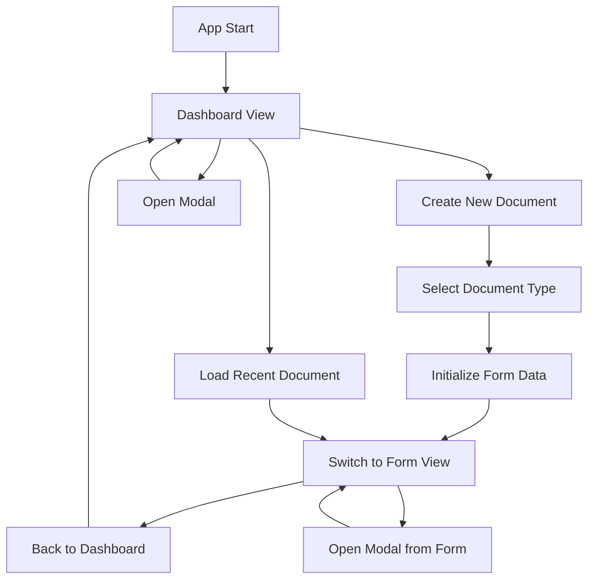

# Dashboard Design for AI Document Generator

## Overview

The dashboard serves as the main landing page, providing key business metrics and quick access to all app functions. It replaces the direct load into the invoice form.

## Layout Structure

### Header

- App title: "AI Document Generator"
- Subtitle: "Create and manage your business documents"

### Metrics Section

4-card grid (responsive: 1 col mobile, 2 col tablet, 4 col desktop)

- **Total Documents**: Count of all saved documents in ledger
- **Total Revenue**: Sum of all document totals across all types
- **Pending Amount**: Sum of unpaid amounts (total - amountPaid) for unpaid documents
- **Overdue Amount**: Sum of overdue unpaid amounts (due date passed)

### Quick Actions Section

6-card grid (responsive: 2 col mobile, 3 col tablet, 6 col desktop)

- **Create New Document**: Primary action button with dropdown menu for all DocumentTypes
- **View All Documents**: Opens DocumentLedgerModal
- **View Analytics**: Opens AnalyticsModal
- **Manage Clients**: Opens ClientManagerModal
- **Manage Items**: Opens ItemManagerModal
- **Cloud Sync**: Opens CloudSyncModal

### Recent Documents Section

Table showing last 5 modified documents:

- Document Number (clickable to load)
- Document Type
- Client Name
- Total Amount
- Status
- Last Modified Date

## Navigation Flow

## Data Sources

- Metrics calculated from ledger data (similar to AnalyticsModal logic)
- Recent documents sorted by lastModified descending
- All modals reuse existing components

## State Management

- Add `currentView: 'dashboard' | 'form'` to App.tsx state
- Default to 'dashboard'
- Switch views on create/load actions

## UI Components

- Use Tailwind CSS classes matching app style (slate colors, rounded corners)
- Icons from existing Icon component or Heroicons
- Responsive grid layouts
- Cards with hover effects for actions
